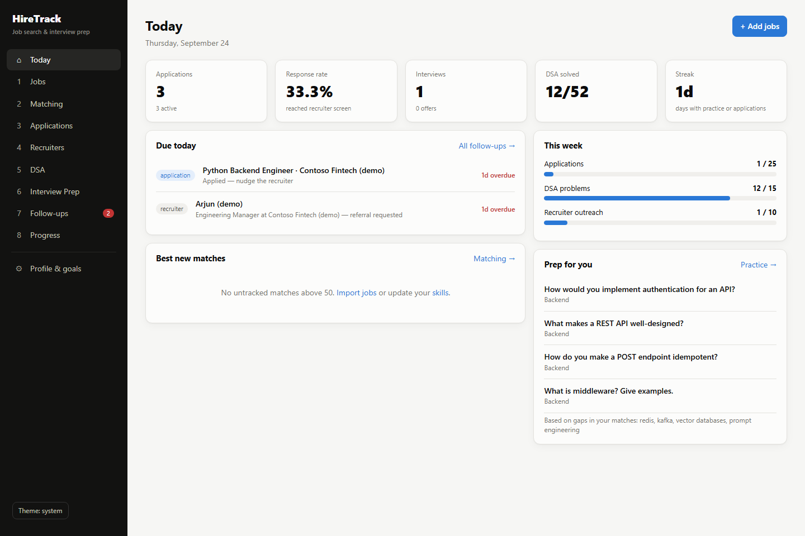
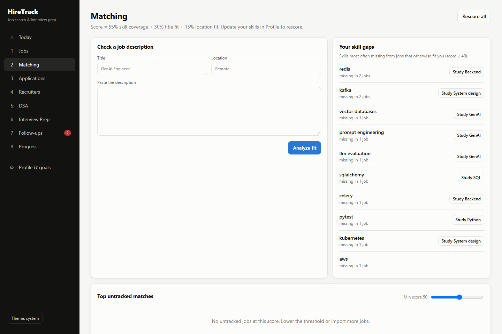
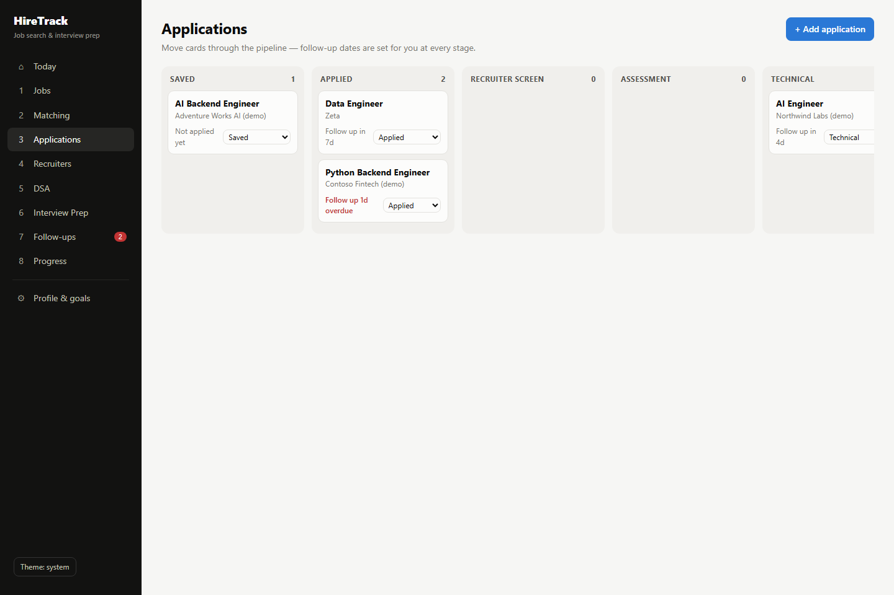
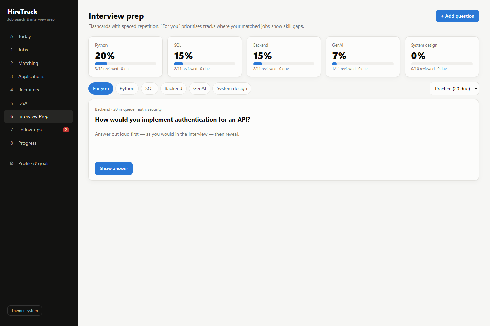
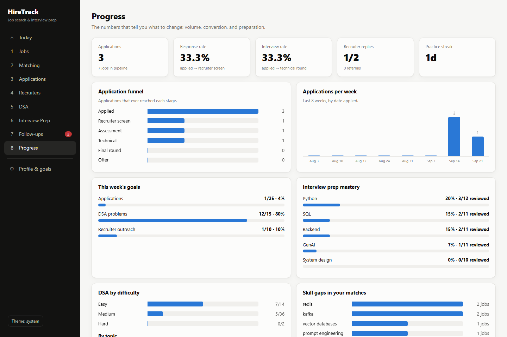

# HireTrack

**A full-stack job search and interview preparation platform.** HireTrack pulls in job postings, scores each one against your skills, tracks every application through the hiring pipeline, reminds you when to follow up with recruiters, and drills you on DSA and interview questions with spaced repetition. It puts extra weight on the skills your target jobs ask for that you don't have yet.

`Python` · `FastAPI` · `SQLAlchemy 2` · `PostgreSQL` · `React 19` · `TypeScript` · `Vite` · `Docker` · `GitHub Actions`



## The workflow

**Jobs → Matching → Applications → Recruiters → DSA → Interview Prep → Follow-ups → Progress**

| Module | What it does |
| --- | --- |
| **Jobs** | Add postings by hand, pull live remote jobs from the [Remotive API](https://remotive.com/api-documentation), or upload a CSV/JSON file. HTML is cleaned, skills are extracted, and duplicates across sources are dropped using a normalised fingerprint. |
| **Matching** | Every job gets an explainable 0–100 score: 55% skill coverage, 30% title fit, and 15% location fit. Remote jobs limited to regions you didn't list score lower on location. Senior roles score lower if you have less experience. You can paste any job description to check your fit without saving it. The **skill-gap report** lists the skills missing most often from jobs you otherwise fit. |
| **Applications** | Kanban board from Saved to Offer. Every stage change is logged, and a follow-up date is set automatically (7 days after applying, 3 after a recruiter screen, and so on). |
| **Recruiters** | Referral and outreach tracker. Moving a contact to *Contacted* schedules a follow-up in 5 days. |
| **DSA** | 52 core problems grouped by pattern. Rate each attempt, and a spaced-repetition schedule (1 → 3 → 7 → 14 → 30 → 60 days) brings weak problems back sooner. |
| **Interview Prep** | 55 flashcards with model answers covering Python, SQL, Backend, GenAI and System Design. The **For you** queue puts first the tracks linked to your skill gaps. |
| **Follow-ups** | One list of overdue and upcoming nudges, with snooze and done actions. |
| **Progress** | Pipeline funnel, response and interview rates, applications per week, weekly goals, practice streak, DSA coverage and prep mastery. |

| Matching & skill gaps | Application pipeline |
| --- | --- |
|  |  |
| **Interview prep** | **Progress** |
|  |  |

## Quick start

### Docker (recommended)

```bash
docker compose up --build
```

- App: http://localhost:3000
- API docs (Swagger): http://localhost:8000/docs

This starts PostgreSQL, the FastAPI backend and the React frontend (served by nginx). Demo data is loaded on first start; set `SEED_DEMO_DATA=false` to start empty.

### Local development

```bash
# Backend: uses SQLite by default, no database setup needed
cd backend
python -m venv .venv && source .venv/bin/activate   # Windows: .venv\Scripts\activate
pip install -r requirements-dev.txt
uvicorn app.main:app --reload                        # http://localhost:8000

# Frontend: in another terminal
cd frontend
npm install
npm run dev                                          # http://localhost:5173 (proxies /api to :8000)
```

To use PostgreSQL locally, copy `backend/.env.example` to `backend/.env` and set `DATABASE_URL`.

### Tests

```bash
cd backend && pytest                           # SQLite
TEST_DATABASE_URL=postgresql+psycopg://... pytest   # PostgreSQL
cd frontend && npm run lint && npm run build
```

CI runs the backend suite against both SQLite and a PostgreSQL service container, then lints and builds the frontend.

## Architecture

```
HireTrack
├── backend/                 FastAPI service
│   ├── app/
│   │   ├── database/        SQLAlchemy engine, session, models (PostgreSQL / SQLite)
│   │   ├── jobs/            ingestion, de-duplication, skill extraction, matching
│   │   ├── routers/         REST endpoints, one module per feature
│   │   ├── services/        spaced-repetition scheduling
│   │   ├── schemas.py       Pydantic request/response models
│   │   └── seed.py          loads /prep content + demo data (idempotent)
│   └── tests/
├── frontend/                React + TypeScript (Vite), served by nginx in Docker
│   └── src/pages/           one page per workflow step
├── prep/                    interview content: edit Markdown/CSV, reloaded on startup
│   ├── dsa/  python/  sql/  backend/  genai/  system-design/
├── docker-compose.yml
└── .github/workflows/ci.yml
```

**Design notes**

- **Explainable matching over black-box scoring.** Skills are pulled from a vocabulary of about 80 canonical skills with their aliases (`Postgres` → `postgresql`, `pgvector` → `vector databases`). Matching respects word boundaries, so `sql` doesn't match inside `postgresql` and `java` doesn't match `javascript`. Every score lists the matched and missing skills.
- **De-duplication by fingerprint.** Company, title and location are normalised: legal suffixes, "(Remote)" and punctuation are removed. The result is hashed into a unique index, so the same role from two sources is stored only once.
- **Audit trail.** Stage changes are stored as events, so the funnel counts how far each application *ever* got, not just where it sits now.
- **Content as code.** Interview questions live in plain Markdown under `prep/`. You can add a question with a pull request, and progress you've already made is never overwritten.

## API overview

| Endpoint | Purpose |
| --- | --- |
| `GET/PUT /api/profile` | Target roles, skills, locations, weekly goals (saving rescores all jobs) |
| `GET/POST /api/jobs`, `POST /api/jobs/upload`, `POST /api/jobs/ingest/remotive` | Job list and ingestion |
| `GET /api/matching`, `POST /api/matching/analyze`, `GET /api/matching/skill-gaps` | Scores, ad-hoc JD analysis, gaps |
| `GET/POST/PATCH /api/applications` | Pipeline with stage history |
| `GET/POST/PATCH /api/recruiters` | Outreach tracker |
| `GET /api/dsa`, `POST /api/dsa/{id}/practice` | DSA list and practice log |
| `GET /api/prep/tracks`, `/questions`, `/recommended`, `POST /questions/{id}/review` | Interview prep |
| `GET /api/followups`, `POST /api/followups/{kind}/{id}/complete` | Unified follow-up queue |
| `GET /api/progress` | All dashboard metrics |

Full interactive docs are at `/docs` when the backend is running.

## Roadmap

- [ ] Authentication and multiple users (OAuth2 + JWT)
- [ ] LLM features: tailored résumé bullets and mock-interview feedback per job description
- [ ] Embedding-based semantic matching alongside keyword matching
- [ ] Scheduled ingestion (Celery beat) and email digests for new high-match jobs
- [ ] Alembic migrations
- [ ] Gmail/Calendar integration to log recruiter replies and interviews automatically
